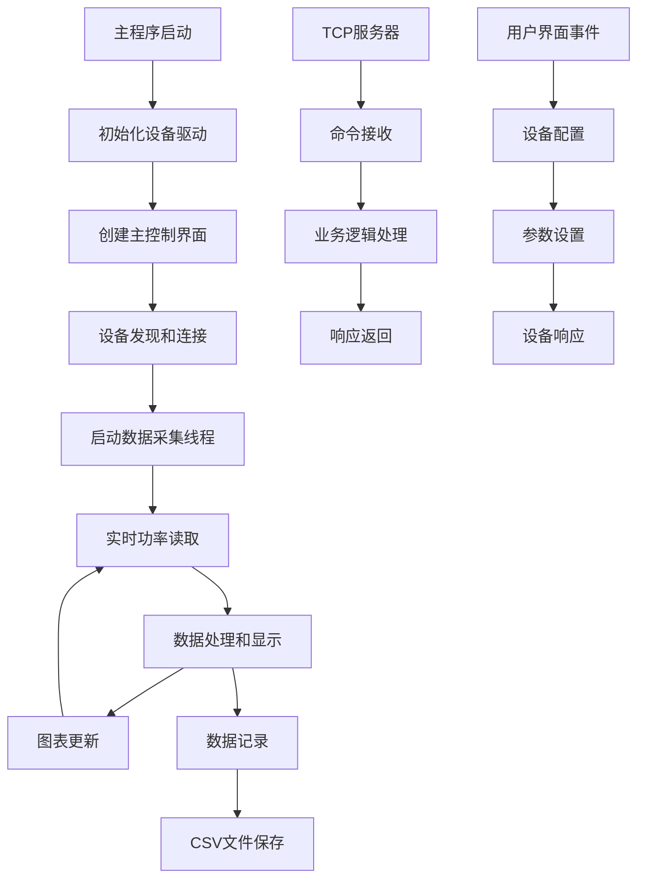

# 索雷伯PM100D功率计控制程序 - 代码结构说明

## 📋 项目概述

本项目是基于Python和PyQt5开发的Thorlabs PM100D系列光功率计控制程序，提供完整的设备控制、数据采集、实时显示和数据记录功能。

**项目信息：**
- **作者：** ivan
- **创建时间：** 2025
- **版本：** v1.0.1
- **开发框架：** PyQt5 + pyvisa
- **支持设备：** Thorlabs PM100D系列光功率计

---

## 🏗️ 项目架构

```
索雷伯功率计/
├── 📁 核心模块/
│   ├── PM100D功率计.py          # 主程序入口
│   ├── PM100D_Control.py        # 主控制逻辑
│   ├── PM100D.py               # 设备驱动
│   └── Ui_PM100D_Control.py    # 界面定义
├── 📁 通信模块/
│   ├── TCPServer.py            # TCP服务器
│   └── TCPClient.py            # TCP客户端
├── 📁 工具模块/
│   ├── utils.py                # 工具函数
│   └── MyPlot.py               # 实时绘图
├── 📁 配置文件/
│   ├── config.ini              # 配置文件
│   ├── PM100D_Control.ui       # Qt界面文件
│   └── 更新内容.csv            # 版本记录
├── 📁 构建文件/
│   ├── PM100D功率计.spec       # PyInstaller配置
│   ├── PM100D_Control.spec     # PyInstaller配置
│   └── pack.sh                 # 打包脚本
└── 📁 数据目录/
    └── Record/                 # 数据记录目录
```

---

## 📂 核心模块详解

### 🎯 主程序入口 - `PM100D功率计.py`

**功能：** 程序启动入口点
```python
- 初始化PyQt5应用程序
- 创建PM100D设备实例
- 启动主控制界面
- 配置多进程支持
```

**关键特性：**
- 支持高DPI显示
- 多进程冻结支持（PyInstaller）
- 异常处理和程序退出管理

---

### 🎮 主控制逻辑 - `PM100D_Control.py`

**功能：** 应用程序的核心控制逻辑
```python
类：PM100D_Control(QtWidgets.QMainWindow, Ui_MainWindow)
```

**主要功能模块：**

#### 🔌 设备管理
- `check_port_callback()` - 设备发现和枚举
- `connect_pm()` - 建立设备连接
- `disconnect_pm()` - 安全断开连接
- `current_port_callback()` - 端口选择处理

#### 📊 数据采集
- `power_record()` - 多线程数据采集循环
- `update_value()` - 实时数据更新
- `value_update` 信号 - 界面数据刷新

#### 💾 数据记录
- `start_record_callback()` - 开始数据记录
- `stop_record_callback()` - 停止并保存记录
- `save_value()` - CSV文件保存
- `value_save` 信号 - 数据持久化

#### ⚙️ 设备配置
- `set_wavelength()` - 波长设置
- `set_compensation()` - 补偿值设置
- `enable_auto_range()` - 启用自动量程
- `disable_auto_range()` - 禁用自动量程

#### 🌐 自动化接口
- `auto_server_controller()` - TCP命令处理
- `make_pack()` - 响应数据打包

---

### 🔧 设备驱动 - `PM100D.py`

**功能：** Thorlabs PM100D功率计的底层驱动
```python
类：PM100D
```

**核心方法：**

#### 🔗 连接管理
```python
def connect(device_name) -> bool
def disconnect() -> None
def heartbeat() -> list
def check_device_status() -> bool
def reconnect_device(device_name, max_retries=3) -> bool
```

#### 📈 数据测量
```python
def read_power() -> list
def zero_adjustment(timeout=3.0, poll_interval=0.1) -> bool
```

#### 🎛️ 参数配置
```python
def get_wavelength() -> float
def set_wavelength(wavelength) -> bool
def get_comp() -> float
def set_comp(comp) -> bool
def set_power_unit(unit='W') -> bool
```

#### 📏 量程控制
```python
def get_range()
def set_range(meas_range) -> bool
def get_auto_range_status() -> bool
def start_auto_range() -> bool
def stop_auto_range() -> bool
```

**技术特点：**
- 基于pyvisa-py的纯Python实现
- 支持USB VISA通信协议
- 完整的错误处理和重连机制
- SCPI命令封装

---

### 🖥️ 界面定义 - `Ui_PM100D_Control.py`

**功能：** PyQt5界面布局和控件定义
```python
类：Ui_MainWindow, ClickableLabel
```

**界面组件：**
- **主布局：** 网格布局管理器
- **设备面板：** 端口选择和连接控制
- **数据显示：** LCD数字显示器（当前值、最大值、最小值）
- **实时绘图：** 嵌入式图表区域
- **控制按钮：** 连接、记录、设置操作
- **配置面板：** 波长、补偿值、量程设置

**特殊控件：**
- `ClickableLabel` - 可点击标签（版本信息）
- 自定义字体和样式设置

---

## 🌐 通信模块详解

### 🖥️ TCP服务器 - `TCPServer.py`

**功能：** 多线程TCP服务器，提供自动化接口
```python
类：TCPServer(QThread)
```

**核心特性：**
- **多客户端支持：** 并发连接处理
- **异步消息处理：** 独立线程处理每个客户端
- **优雅关闭：** 资源清理和连接管理
- **JSON协议：** 结构化命令和响应

**API接口：**
```json
{
  "opcode": "GetPower",           // 获取功率值
  "opcode": "RecordCon",          // 记录控制
  "opcode": "ConnectDevice",      // 连接设备
  "opcode": "check"               // 检查版本
}
```

### 💻 TCP客户端 - `TCPClient.py`

**功能：** 异步TCP客户端，用于与服务器通信
```python
类：TCPClient(QThread)
```

**主要功能：**
- **异步连接：** 非阻塞TCP连接
- **消息缓冲：** 多行消息处理
- **信号通知：** PyQt5信号槽机制
- **错误恢复：** 连接状态监控

---

## 🛠️ 工具模块详解

### 🔧 工具函数 - `utils.py`

**功能：** 通用工具函数集合

#### 数据转换工具
```python
def ToI32(hex_str: str) -> int        # 16进制转32位有符号整数
def ToI16(hex_str: str) -> int        # 16进制转16位有符号整数  
def ToFloat(hex_str: str) -> float    # 16进制转IEEE754浮点数
def ToHex(num: int, size: int) -> str # 整数转16进制字符串
```

#### 配置管理工具
```python
def read_config() -> ConfigParser     # 读取INI配置文件
def edit_config(section, key, value) -> bool  # 编辑配置文件
```

#### 界面工具
```python
def showAbout(self)                   # 显示关于对话框
def force_reset_usb(vendor_id, product_id)  # USB设备重置
```

### 📊 实时绘图 - `MyPlot.py`

**功能：** 基于pyqtgraph的实时数据绘图控件
```python
类：MyPlot(pg.GraphicsLayoutWidget)
```

**核心功能：**
- **实时更新：** 信号驱动的数据刷新
- **多序列支持：** 可切换显示不同数据序列
- **交互操作：** 双击切换、自动缩放
- **数据管理：** 数据缓冲和清理

**数据流：**
```
数据采集 → update_signal → updateData() → 图表刷新
```

---

## 📁 配置和构建文件

### ⚙️ 配置文件

| 文件名 | 用途 | 格式 |
|--------|------|------|
| `config.ini` | 程序配置存储 | INI格式 |
| `更新内容.csv` | 版本更新记录 | CSV格式 |
| `PM100D_Control.ui` | Qt界面设计文件 | XML格式 |

### 🏗️ 构建文件

| 文件名 | 用途 | 说明 |
|--------|------|------|
| `PM100D功率计.spec` | PyInstaller配置（单文件） | 可执行文件打包 |
| `PM100D_Control.spec` | PyInstaller配置（多文件） | 开发调试版本 |
| `pack.sh` | Linux打包脚本 | 自动化构建 |
| `PM100D功率计.cmd` | Windows启动脚本 | 批处理文件 |

---

## 🔄 数据流图



---

## 🧵 线程架构

### 主线程
- **GUI界面：** 用户交互和界面更新
- **事件处理：** 按钮点击、信号槽处理

### 工作线程
- **数据采集线程：** `ThreadPoolExecutor`管理的功率读取任务
- **TCP服务器线程：** 客户端连接监听和处理
- **TCP客户端线程：** 异步网络通信

### 线程同步
- **PyQt5信号槽：** 线程间安全通信
- **线程池管理：** 任务提交和取消机制
- **优雅关闭：** 线程资源清理

---

## 📊 性能特征

### 数据采集性能
- **采集频率：** 约143Hz（7ms间隔）
- **UI更新频率：** 约14Hz（每10次采集更新一次界面）
- **数据精度：** 保留2位小数
- **缓冲机制：** 内存缓冲 + 磁盘持久化

### 内存使用
- **基础占用：** ~50MB（PyQt5 + numpy + pandas）
- **数据缓冲：** 动态增长，支持长时间记录
- **图表数据：** numpy数组优化

### 网络性能
- **TCP连接：** 支持多客户端并发
- **消息格式：** JSON，支持命令-响应模式
- **超时处理：** 连接超时和重试机制

---

## 🛡️ 错误处理机制

### 设备错误处理
```python
try:
    # 设备操作
except pyvisa.VisaIOError:
    # VISA通信错误
except Exception:
    # 通用异常处理
```

### 数据采集错误
- **连接断开检测**
- **无效数据过滤**
- **自动重连机制**

### 文件操作错误
- **权限检查**
- **磁盘空间检测**
- **文件锁处理**

---

## 🔧 扩展指南

### 添加新设备支持
1. 继承`BaseDevice`基类
2. 实现设备特定的通信协议
3. 在`PM100D_Control.py`中集成

### 自定义数据处理
1. 修改`power_record()`方法
2. 添加新的信号槽连接
3. 扩展数据保存格式

### 网络接口扩展
1. 在`auto_server_controller()`中添加新命令
2. 定义JSON消息格式
3. 实现对应的业务逻辑

---

## 📝 开发规范

### 代码风格
- **文档字符串：** Google风格
- **注释语言：** 简体中文
- **命名规范：** 驼峰命名法
- **类型提示：** 关键函数使用类型注解

### 版本管理
- **版本号格式：** vMajor.Minor.Patch
- **更新记录：** 记录在`更新内容.csv`
- **Git标签：** 对应版本发布

### 测试建议
- **单元测试：** 设备驱动模块
- **集成测试：** 完整数据采集流程
- **界面测试：** 用户操作场景

---

## 🚀 部署说明

### 环境要求
```
Python 3.7+
PyQt5 >= 5.15
pyvisa >= 1.11
pyvisa-py >= 0.5
numpy >= 1.19
pandas >= 1.3
pyqtgraph >= 0.12
pyusb >= 1.2
```

### 打包部署
```bash
# 使用PyInstaller打包
pyinstaller PM100D功率计.spec

# 或使用脚本打包
bash pack.sh
```

### 驱动安装
1. 复制`libusb1.0.dll`到系统目录
2. 确认设备识别正常

---

*本文档生成时间：2025年*  
*版本：v1.0.1*  
*作者：ivan* 